# git

### 应用场景：

大家在开发项目的过程中，如果直接在本地系统上维护源码目录，经常会碰见下面的问题：

+ 不小心把源代码的目录或文件删了，写了好久的代码没了！
+ 按需求添加新功能，写了好多代码，但净是编译错误，改都改不完，想回到之前的版本，开始大面积删除或者屏蔽代码，很崩溃，如果此时有个代码版本管理工具，该多好！
+ 新功能添加完了，编译运行一切很顺利，功能也正常，但有时候运行会出现以前没见过的运行错误，非必现的，想查看和之前代码的差异，看看都在哪些源文件中修改了代码，该怎么办？
+ 团队开发项目，但是项目成员都不在一起，各自写的代码该如何添加到一块，还能避免错误，不会出现谁把谁的代码给覆盖了？


### git介绍

git是目前世界上最先进的分布式版本控制系统（对比集中式版本控制系统SVN），没有之一!

> SVN : 集中式版本控制系统，在`SVN Server` 服务器上，维护了代码的所有版本。在每一个客户机上存在一个`SVN client` ， 通过连接网络请求放在`SVN Server` 上的源代码。也就是说，所有的版本维护都是放在 `SVN Server` 所以将`SVN Server` 称为代码仓库。==使用SVN进行共同开发，必须在同一局域网，而git则没有这个限制==
>
> git ： 分布式版本控制系统，在每一个客户端，都存在一个git 仓库，每一个客户端都可以单独工作，用户可以提交代码到本地进行代码版本的维护，
>
> 同时，存在==代码版本托管平台(远程仓库，例如github)== , 可以通过远程仓库，将不同客户端的本地仓库中的内容提交到远程仓库，同时可以将远程仓库拉取到本地，实现项目的共同开发与版本控制。

 

### github介绍

总结: 一个免费的代码远程托管仓库。 


### 本地git和远程的github通信

在`git bash` 中通过`ssh -T git@github.com` 测试本地是否能通过ssh访问github (如果将本地执行`ssh-keygen -t rsa -C "注册账号的邮箱名字"`生成的公钥上传到github的settings中) 


配置邮箱和用户名，以后你在git hub上提交的任何代码文件，都会附带你的邮箱用户名信息，如下：

> git config --global user.name "hsa"
>
> git config --global user.email "214629874"


+ 通过`ssh`从`github`拉取项目：

  > git clone  git@github.com:123han12/HelloWorld.git      // 从 github上拉取项目

​    当从github上拉取之后，有两个东西会自动创建：

> + 远程仓库的名称： origin   。 可以在 刚才拉取的项目的文件夹HelloWorld下==执行`git remote` 查看在本地的远程仓库的名称，默认为origin==
>
>   如果要修改远程仓库的名称，可以修改Helloworld文件夹中的隐藏文件夹`.git`下的`config`文件中的`remote`部分的名称。
>
> + 自动生成本地仓库：生成一个默认的主干分支**main**(也就是此时本地仓库所有分支)追踪的就是远程仓库`origin` , 通过`git branch` 可以查看当时的所有分支以及当前所位于的分支。
>
>   


+ git的工作区就是：==本地代码的工作目录== ， 也就是本地的`Helloworld`目录 ， 如果在工作目录下，新添加了文件，可以通过以下命令将其添加到本地仓库

  > `git add XX` : 将工作区文件添加到暂存区
  >
  > `git commit -m "给自己看的备注信息"` ： 将暂存区的内容提交到当前分支main上。


+ 将本地仓库中的内容提交到远程仓库：在工作区执行以下指令

  > `git  push(git push origin main:main)` : 提交本地仓库到远程仓库(提交本地的main分支上的内容到远程仓库origin的main分支上，其中起一个main表示的是本地的main分支，第二个main表示的是origin中的main分支)
  >
  > `git log` : 查看提交日志信息

+ 从window下拉取上一步WSL下提交的内容：

  > `git pull` :  将远程仓库的当前分支和本地仓库的当前分支合并。
  >
  > 

+ `HEAD` 指针：

  > 本地仓库每一个分支上的代码修改都会生成一个commit id信息，HEAD指针指向最近一次的commit提交，通过这个commit id可以进行版本回退,当切换分支的时候，HEAD指针也会做出同样的修改，指向相应的分支的最后一次的提交。


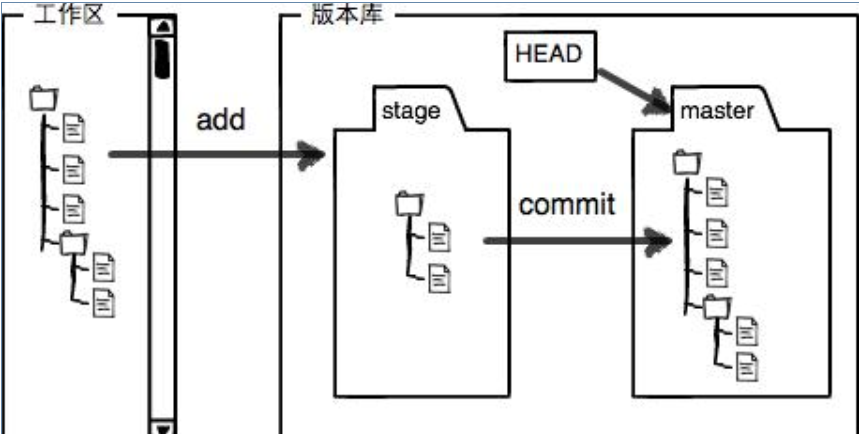

、


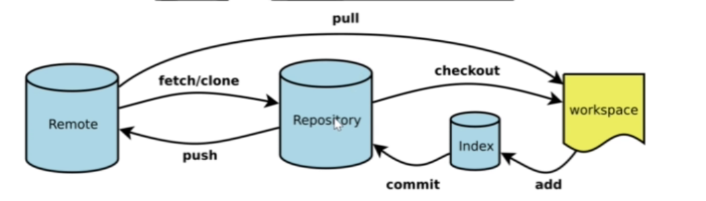

> 注：index 表示的是暂存区，workspace表示的是工作区，Repository表示的是本地仓库，Remote 表示的是远程仓库。


### git各阶段代码修改回退撤销操作

+ workspace阶段

> `git checkout -- [main.cpp | .]` : 使用本地仓库相应分支的代码覆盖此时的==工作区==中的内容/文件。

+ index阶段

> `git reset HEAD <filename>` : 将已经提交到暂存区的内容或指定的文件删除，但工作区的修改不变
>
> `git restore --staged [. | filename ]` : 将提交到暂存区的内容或单独的一个文件删除，但工作区修改不变

+ repository阶段

> `git reset --hard <commit id> ` :  本地仓库的HEAD回退到指定的版本,==并且工作区的代码也回退到此版本==(回退到之前的版本之后，原本的最新的版本的在执行`git log`的时候不可见)
>
> 如果想要回到原来的最新版本：
>
> + `git reflog` 查看原本的最新版本的`commit-id`  ： 查看HEAD指针的移动历史（包括被回滚的版本）
> + 执行 `git reset --hard commit-id` 则成功回退，==并且此时工作区也回退到此版本==
>
> 


+ remote 阶段：假设此时最新版本为A ，其前一个版本为B ， 此时远程仓库和本地仓库均为A

> 先回退本地仓库，再强制更新远程仓库。
>
> `git reset --hard <commit-id>` : 先将本地的仓库会退到B版本
>
> ==如果本地分支的版本落后于远程分支的版本，此时执行`git push origin main:main`== 会报如下错误：
>
> 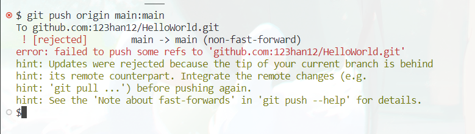
>
> git不允许本地的落后版本提交到远程分支的原因：==在多人同时开发一个项目的时候，无法确定最新版本是不是你提交的，如果别人对项目做出了很大的修改，你这个落后版本如果提交到了git，别人的代码就付之一炬了，非常不好，所以git不允许==  但当我们确认远程仓库此时的代码版本A不会因为此时的本地的代码版本B的提交而丢失内容，此时可以使用：
>
> `git push -f origin main:main ` : ==强制提交本地分支到对应的远程分支==。(如果不加-f 只有当本地的版本比远程的版本新的时候才能更新成功 ，也就是说如果同事A和同事B一起开发远程项目C，C的版本为S , 并且此时A同事和B同事本地的版本为S , 如果B 此时修改了之后向远程项目提交了新版本T , 此时同事A 如果直接使用 git push 是无法成功的。) 

 

> 注： `git diff HEAD -- [ <filename> | . ] `查看工作区file文件或所有内容和该仓库文件最新版本的代码有什么区别
>
> `git diff`：当工作区有改动，临时区为空，diff的对比是“工作区与最后一次commit提交的仓库的共同文件”；当工作区有改动，临时区不为空，diff对比的是“工作区与暂存区的共同文件”。


### git推送代码的冲突解决方案

首先在进行多人开发的时候谨记的一条规则就是：==在本地开发之前，一定先执行`git pull`将远程仓库中的版本拉取下来。==

==问题场景1：==

> 同事A和同事B同事开发一个github项目C其此时的版本为V1 , A和B都在各自的本地执行`git pull` 此时各自的代码版本都是`v1` , 如果B开发出`V3`版本，A同时开发出`V2`版本，但B先进行了一个提交，如果B提交之后，A再进行一个提交，则A的终端会出现：
>
> 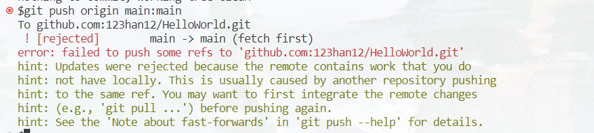
>
> ==解决办法：==
>
> + 在A的终端执行`git pull` : 这个会默认将远程的最新版本拉取下来和==本地的当前分支的最新版本进行合并==(前提是两者修改的不是同一个地方，不会产生合并时的冲突)。
>
>   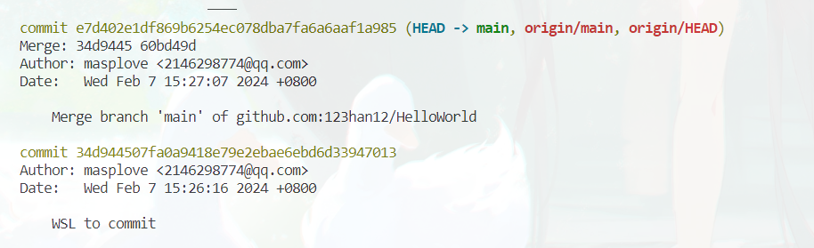
>
>   最新的一个==代码版本== 是由本地的一个代码版本和远程最新的代码版本合并而成的。
>
> + 执行`git push` ： 将本地的所有分支推送到远程对应分支。
>
>   

==问题场景二：需要手动解决的冲突==

> 同事A和同事B同事开发一个github项目C其此时的版本为V1 , A和B都在各自的本地执行`git pull` 此时各自的代码版本都是`v1` , 如果B开发出`V3`版本，A同时开发出`V2`版本 , 并且说A和B修改的是同一个地方，但改到了不同的内容，假设此时B先提交：
>
> 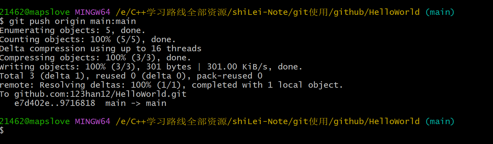
>
> 成功提交。
>
> 之后再是A再提交：
>
> 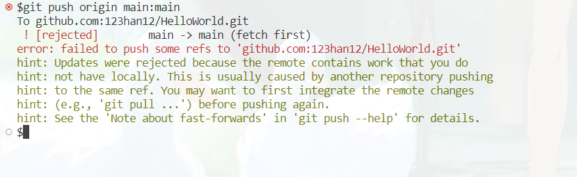
>
> ==解决策略：== 
>
> + A先将远程仓库拉取下来`git pull` ，出现错误：
>
>   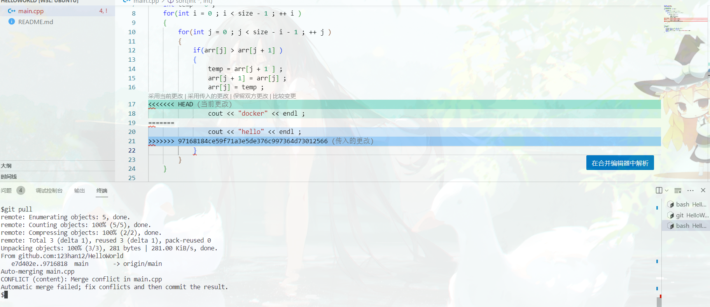
>
>   这时候需要==手动解决冲突==：
>
>   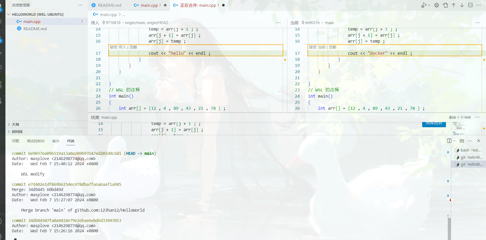
>
> 选择合并的部分之后：==此时解决完冲突之后就存放的到了暂存区==
>
> 执行`git commit -m "xxx"` 提交此时暂存区的内容到本地仓库，执行`git push origin main:main` 将当前的分支提交的到远程分支。
>
> 

 

### git分支版本控制命令[注：这一小节的sortdev和sortev01指的是同一个分支]

#### 本地分支管理

【step 1】windows让WSL给他写的冒泡排序进行一下优化，当一趟排完了，发现没有进行任何数据交换，那么就直接结束排序，WSL想着最好不要在master分支修改代码，还是重新创建一个本地分支吧，写完代码测试好，我再合并到master主干分支上，然后再推送到远程代码仓库中，最为稳妥，master主干分支代码干干净净，省的我改来改去，把原来好的代码改错了。

> 第一种方式：
>
> `git checkout -b sortdev` : 创建一个名为`sortdev`的分支,并且切换到该分支。
>
> `git branch ` : 查看当前分支
>
> 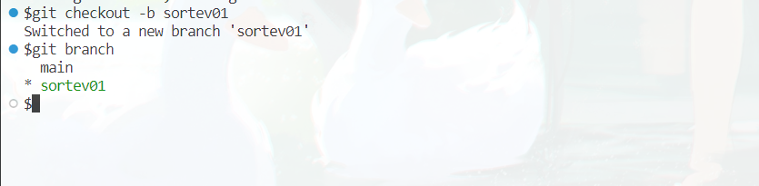
>
> 或者使用这个组合：
>
> `git branch sortdev`：创建名为`sortdev`的新分支
>
> `git branch`：查看所有分支和当前所处分支
>
> `git checkout sortdev`：切换到`sortdev`这个分支
>
> 给出示意图也就是:
>
> 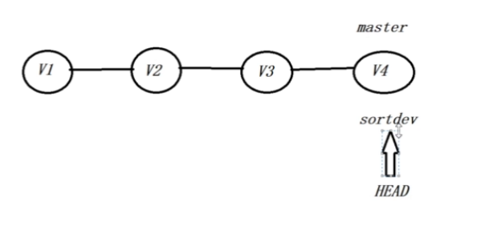
>
> 此时`sortdev`分支的第一个节点是`V4` , `HEAD`指针 指向的是这个`V4`节点，也就是`sortdev`的第一个节点。
>
> ==注意，此时在`sortdev`分支上执行`git pull` 会报错，因为此时在远程仓库上不存在其对应的分支，git无法知道其需要的内容，需要先将这个分支在远程仓库进行创建，并且使得本地的`sortdev`和远程的`sortdev`关联，此时在本地的`sortdev`进行`git pull`才会成功。== 操作步骤：
>
> + 

【step 2】WSL在`sortev01`分支上进行的代码修改，测试正确以后，可以切换到`master`分支上，然后通过`git merge`命令把`sortev01`分支上的代码改动合并到`master`主干分支上，然后推送到远程的代码仓库当中，如下：

> `git checkout main` : 先切换到`main` 分支上。
>
> `git merge sortev01` : 将`sortev01`分支合并到当前分支(`main`)上。(实际上就是将`sortev01`分支的内容在`main`分支上延续，但`sortev01`分支仍然存在)
>
> `git branch -d sortev01` : 删除指定的`sortev01`分支，如果此时的分支有提交没有合并到`main`分支上，则需要将`-d`改为`-D` 从而实现分支的强制删除。
>
> `git push origin sortev01:main` : 将本地`sortev01` 分支上的代码推送到远程的`main`分支上。  


### 分支合并冲突的解决方案

问题场景：上一小节把sortdev01分支合并到master分支上时一切顺利，是因为sortdev01分支在合并的时候，master分支没有做过任何改动，看图：

> 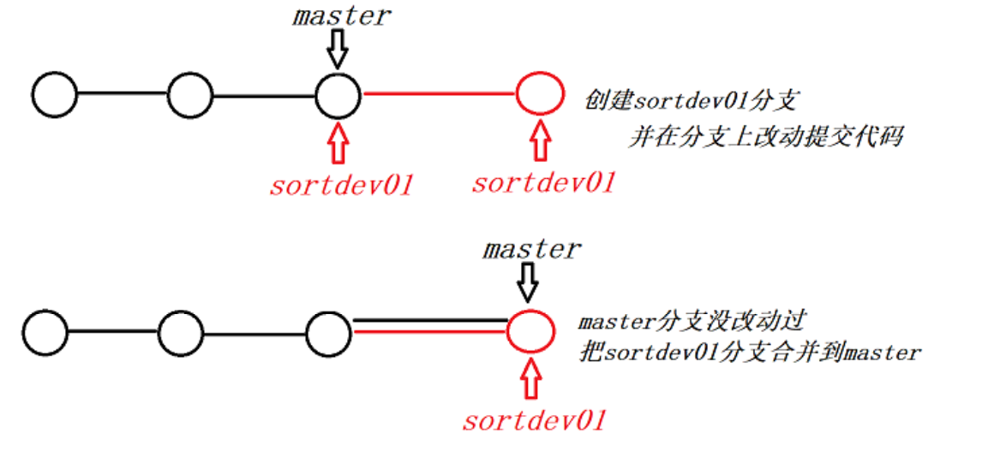
>
> 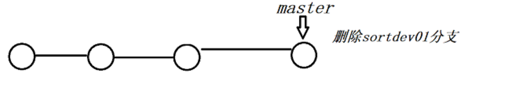
>
> 实际上有可能发生这样的情况：
> .WSL从master分支创建了一个新的分支sortdev01，进行代码开发测试，提交
> .windows更新了master分支上的代码
> .WSL切换分支到master，git pull同步远程仓库master主干的最新代码，发现有变化
> .WSL直接git merge sortdev01就发生冲突了
>
> 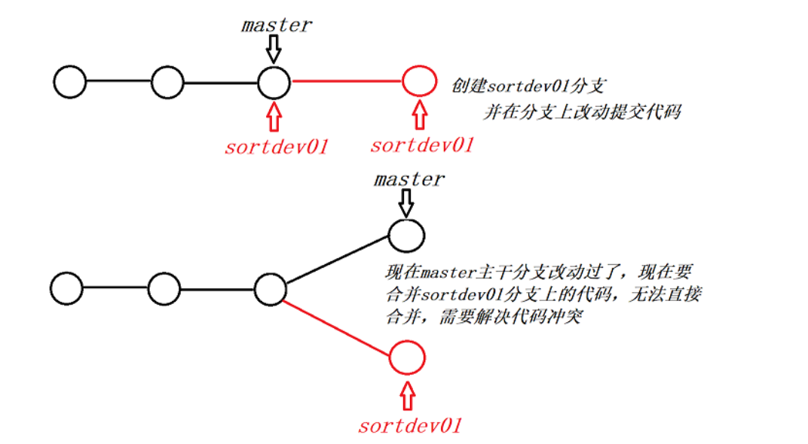
>
> 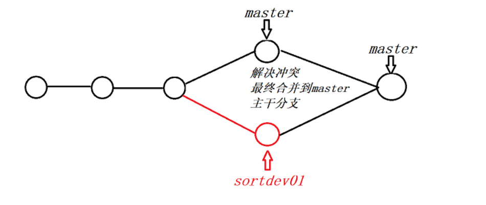
>
> 当WSL在`sortev01`分支修改`readme.md`文件后提交到`sortev01`分支，`windows`修改同样的文件位置，并且提交到本地仓库，并`push`到远程仓库后，在`WSL` 切换回`main`分支后，执行`git pull` 之后 ， 执行`git merge sortev01` 合并分支则会出现上图的问题：
>
> 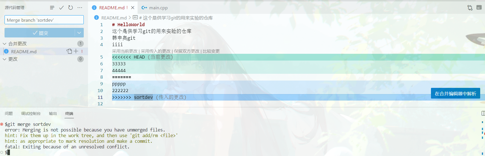
>
> ==当手动合并完成之后，此时合并完后的版本位于**暂存区** ，执行`git commit -m "xxx"`提交到本地的`main `分支，之后使用`git push origin main:main`提交到远程分支==
>
> 


### git创建远程分支的应用实践

我们在github上创建一个代码仓库，默认就拉了一个`main`主干分支，我们在`main`主干分支上开发了一期项目以后，再进行二期开发的时候，可以再拉一个`dev`分支出来，大家都在`dev`分支上开发，此时项目管理员可以把`main`分支的写权限关掉，因为一期功能开发验证完成，很稳定，此时可以拉取`main`代码，不能再push推送代码到`main`分支。
==一般远程分支的创建都是由项目管理员来创建的，其它员工没有创建远程分支的权限，而且每一个远程分支的读写权限也都是由管理员来控制的。==

【step 1】由王sir在github上创建一个dev分支，来继续开发新的功能

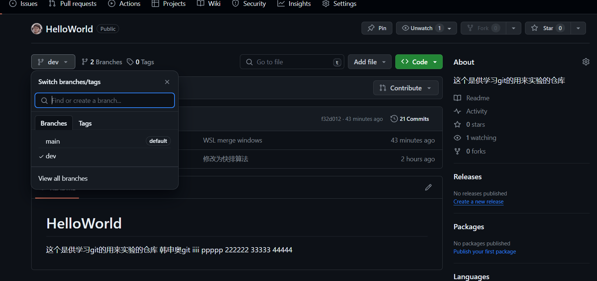

【step 2】小张在git bash上通过git pull更新仓库内容

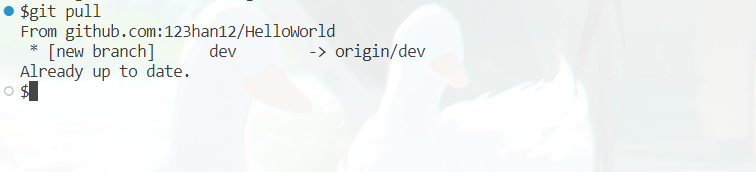

> `git branch -r` ： 查看此时的远程仓库中的所有分支。
>
> `git branch -d <branchname>` : 删除指定的分支
>
> `git branch -vv` : 查看本地所有分支和远程分支的对应关系


【step 3】小张自己的`git bash`上创建了一个本地的`dev`分支，==注意在本地创建的分支，需要设置跟踪哪个远程分支（拉远程仓库的主干分支，默认就在本地创建了一个main分支，并追踪了远程的origin/main分支，但其它分支的追踪关系，就需要自己设置了）==，这样在本地`dev`分支推送代码的时候就简单了

> `git checkout -b dev origin/dev` : 本地生成一个`dev`分支，并且将其对应到远程仓库的`dev`分支(前提是远程仓库origin存在dev分支)
>
> 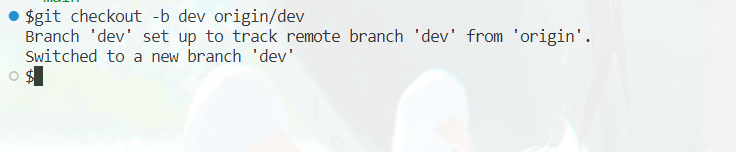
> 创建远程分支和删除远程分支一般员工是没有权限的，所以此处的命令就不罗列了，大家感兴趣可以在网上查阅，这个操作只能由管理员来执行。如果是搭建自己的git私服代码托管，那就可以随便折腾了
> 查看远程仓库名称：`git remote` 一般远程仓库默认的名字是origin
> 查看本地分支：`git branch`
> 查看远程分支：`git branch -r`
> 查看本地分支和远程分支的追踪关系：`git branch -vv`
> 创建本地分支并指定追踪哪个远程分支：`git checkout -b <本地分支名> <远程仓库名>/<远程分支名>`
> 设置已经存在的本地分支追踪哪个远程分支：`git branch -u  <远程仓库名>/<远程分支名>`


### 总结一些`git`常用命令

> #### 全局设置
>
> 1.  `git config --global user.name xxx`：设置全局用户名，信息记录在`~/.gitconfig`文件中
> 2.  `git config --global user.email xxx@xxx.com`：设置全局邮箱地址，信息记录在`~/.gitconfig`文件中
> 3.  `git init`：将当前目录配置成git仓库，信息记录在隐藏的.git文件夹中
>
> #### 常用命令
>
> 1.  `git add XX` ：将XX文件添加到暂存区
> 2.  `git commit -m "给自己看的备注信息"`：将暂存区的内容提交到当前分支
> 3.  `git status`：查看仓库状态
> 4.  `git log`：查看当前分支的所有版本
> 5.  `git push -u (第一次需要-u以后不需要)` ：将当前分支推送到远程仓库
> 6.  `git clone git@git.acwing.com:xxx/XXX.git`：将远程仓库XXX下载到当前目录下
> 7.  `git branch`：查看所有分支和当前所处分支
>
> #### 查看命令
>
> 1.  `git diff XX`：查看XX文件相对于暂存区修改了哪些内容
> 2.  `git status`：查看仓库状态
> 3.  `git log`：查看当前分支的所有版本
> 4.  `git log --pretty=oneline`：用一行来显示
> 5.  `git reflog`：查看HEAD指针的移动历史（包括被回滚的版本）
> 6.  `git branch`：查看所有分支和当前所处分支
> 7.  `git pull` ：将远程仓库的当前分支与本地仓库的当前分支合并
>
> #### 删除命令
>
> 1.  `git rm --cached XX`：将文件从仓库索引目录中删掉，不希望管理这个文件
> 2.  `git restore --staged xx`：==将xx从暂存区里移除==
> 3.  `git checkout — XX`或`git restore XX`：==将XX文件尚未加入暂存区的修改全部撤销，恢复到暂存区的内容==
>
> #### 代码回滚
>
> 1.  `git reset --hard HEAD^` 或`git reset --hard HEAD~` ：将代码库回滚到上一个版本 ==含义就是将当前工作区中的代码恢复到指定的版本==
> 2.  `git reset --hard HEAD^^`：往上回滚两次，以此类推
> 3.  `git reset --hard HEAD~100`：往上回滚100个版本
> 4.  `git reset --hard 版本号`：回滚到某一特定版本
>
> #### 远程仓库
>
> 1.  `git remote add origin git@git.acwing.com:xxx/XXX.git`：将本地仓库关联到远程仓库
> 2.  `git push -u (第一次需要-u以后不需要)` ：将当前分支推送到远程仓库
> 3.  `git push origin branch_name`：将本地的某个分支推送到远程仓库
> 4.  `git clone git@git.acwing.com:xxx/XXX.git`：将远程仓库XXX下载到当前目录下
> 5.  `git push --set-upstream origin branch_name`：设置本地的`branch_name`分支对应远程仓库的`branch_name`分支(如果远程仓库不存在则创建)
> 6.  `git push -d origin branch_name`：删除远程仓库的`branch_name`分支
> 7.  `git checkout -t origin/branch_name` 将远程的`branch_name`分支拉取到本地
> 8.  `git pull` ：将远程仓库的当前分支与本地仓库的当前分支合并
> 9.  `git pull origin branch_name`：将远程仓库的`branch_name`分支与本地仓库的当前分支合并
> 10.  `git branch --set-upstream-to=origin/branch_name1 branch_name2`：将远程的`branch_name1`分支与本地的`branch_name2`分支对应
>
> #### 分支命令
>
> 1.  `git branch branch_name`：创建新分支
> 2.  `git branch`：查看所有分支和当前所处分支
> 3.  `git checkout -b branch_name`：创建并切换到`branch_name`这个分支
> 4.  `git checkout branch_name`：切换到`branch_name`这个分支
> 5.  `git merge branch_name`：将分支`branch_name`合并到当前分支上
> 6.  `git branch -d branch_name`：删除本地仓库的`branch_name`分支
> 7.  `git push --set-upstream origin branch_name`：设置本地的`branch_name`分支对应远程仓库的`branch_name`分支
> 8.  `git push -d origin branch_name`：删除远程仓库的`branch_name`分支
> 9.  `git checkout -t origin/branch_name` 将远程的`branch_name`分支拉取到本地
> 10.  `git pull` ：将远程仓库的当前分支与本地仓库的当前分支合并
>      *   `git pull origin branch_name`：将远程仓库的`branch_name`分支与本地仓库的当前分支合并
> 11.  `git branch --set-upstream-to=origin/branch_name1 branch_name2`：将远程的`branch_name1`分支与本地的`branch_name2`分支对应
>
> #### stash暂存
>
> 1.  `git stash`：将工作区和暂存区中尚未提交的修改存入栈中
> 2.  `git stash apply`：将栈顶存储的修改恢复到当前分支，但不删除栈顶元素
> 3.  `git stash drop`：删除栈顶存储的修改
> 4.  `git stash pop`：将栈顶存储的修改恢复到当前分支，同时删除栈顶元素
> 5.  `git stash list`：查看栈中所有元素


## 常见报错以及解决方式

```
新建的git，在git push的时候遇到了报错“fatal: I don't handle protocol 'git@http'”

网上搜这个错误基本都是“fatal: I don't handle protocol 'git@https'”的情况，最终在同事的帮助下解决：

 

解决办法：

打开.git/config

将[remote “origin”]选项下的url的值从git@http开头改为http开头，即去掉最前面的git@
```


```
报错信息
         fatal: unable to access 'https://github.com/xxx/autowrite.git/': 
         OpenSSL SSL_read: Connection was reset, errno 10054

        fatal: unable to access 'https://github.com/xxx/autowrite.git/':
        Failed to connect to github.com port 443: Timed out

因为git在拉取或者提交项目时，中间会有git的http和https代理，但是我们本地环境本身就有SSL协议了，所以取消git的https代理即可，不行再取消http的代理。

后续
原因还有一个，当前代理网速过慢，所以偶尔会成功，偶尔失败。

2.解决方案
1.在项目文件夹的命令行窗口执行下面代码，然后再git commit 或git clone
取消git本身的https代理，使用自己本机的代理，如果没有的话，其实默认还是用git的

//取消http代理
git config --global --unset http.proxy
//取消https代理 
git config --global --unset https.proxy


```


```
$git pull origin master
From github.com:123han12/Tools

branch master -> FETCH_HEAD fatal: refusing to merge unrelated histories
```


> 这个错误提示表明你正试图合并两个没有共同历史的分支。这通常发生在两个分支之间的提交历史不相关时。在这种情况下，Git会拒绝自动合并，并提示你手动解决冲突。
>
> 要解决这个问题，你可以使用 `--allow-unrelated-histories` 参数强制合并两个不相关的分支。执行以下命令：
>
> `git pull origin master --allow-unrelated-histories`
>
> 这将允许Git尝试合并两个没有共同历史的分支。根据你的具体情况，可能会出现冲突需要手动解决。
>
> 完成冲突解决后，再次尝试推送你的本地分支：     
>
> `git push --set-upstream origin master`
>
> 这样，你的本地分支应该成功推送到远程仓库。如果你不希望使用 `--allow-unrelated-histories` 参数，你可以考虑创建一个新的分支，并将需要的更改合并到该新分支中，然后再推送到远程仓库。


```
 ! [rejected]        master -> master (fetch first)
error: failed to push some refs to 'github.com:123han12/CPP-Basics.git'
hint: Updates were rejected because the remote contains work that you do
hint: not have locally. This is usually caused by another repository pushing
hint: to the same ref. You may want to first integrate the remote changes
hint: (e.g., 'git pull ...') before pushing again.
hint: See the 'Note about fast-forwards' in 'git push --help' for details.
```

> 该错误信息表明您在尝试将更改推送到远程仓库时出现了问题。
>
> 错误提示中指出，推送被拒绝，因为远程仓库包含您本地没有的工作内容。这通常是由于另一个仓库推送到了相同的引用（ref）导致的。为了解决这个问题，建议您在推送之前先整合远程的变更。
>
> 您可以按照以下步骤来解决这个问题：
>
> 1. 首先，运行`git pull`命令，将远程的变更合并到您本地的分支中。这将更新您本地的代码，并将远程的变更与您当前的更改进行整合。
>
>          git pull origin master
>
> 
>
>     注意，如果您的远程仓库不是以"origin"命名的，您需要将其替换为正确的远程仓库名称。
>
> 2. 如果在合并过程中出现冲突，您需要解决冲突并手动编辑文件来解决冲突。
>
> 3. 在成功合并并解决冲突之后，再次运行`git push`命令来将您的更改推送到远程仓库。
>
>          git push origin master
>
> 
>
>     如果您的远程仓库不是以"origin"命名的，同样需要将其替换为正确的远程仓库名称。
>
>
> 如果您继续遇到推送问题，可能是由于其他问题导致，请确保您对仓库具有适当的权限，并且您的本地仓库正确设置了远程仓库的URL。您还可以查看Git文档或创建问题来获取更多帮助和支持。 


